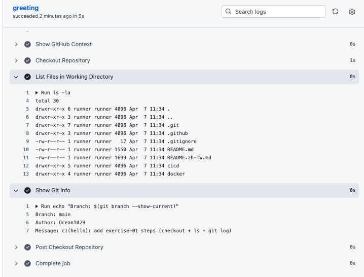

# 練習一：GitHub Actions 基礎練習

> **難度：** 入門 ｜ **對應章節：** [02 — GitHub Actions 基礎](../02-github-actions-basics.md)

## Table of Contents

- [練習：自訂 Hello World](#練習自訂-hello-world)
- [延伸思考](#延伸思考)

## 練習：自訂 Hello World

### 目標

在第 02 章建立的 `.github/workflows/hello.yml`（不是 `repo-info.yml`）上面加新的 step，熟悉 GitHub Actions step 的基本寫法。

### 要求

回顧一下第 02 章建立的 `hello.yml`：

```yaml
name: Hello GitHub Actions

on:
  push:
    branches: [main]
  workflow_dispatch:

jobs:
  greeting:
    runs-on: ubuntu-latest
    steps:
      - name: Say Hello
        run: echo "Hello, GitHub Actions!"

      - name: Show System Info
        run: |
          echo "OS: $(uname -s)"
          echo "Architecture: $(uname -m)"
          echo "Go Version: $(go version)"
          echo "Docker Version: $(docker --version)"
          echo "Current Time: $(date)"

      - name: Show GitHub Context
        run: |
          echo "Repository: ${{ github.repository }}"
          echo "Branch: ${{ github.ref_name }}"
          echo "Commit SHA: ${{ github.sha }}"
          echo "Actor: ${{ github.actor }}"
          echo "Event: ${{ github.event_name }}"
```

請在這份 workflow 的最後**新增**兩個 step：

1. 使用 `actions/checkout@v4` 把 repo 的程式碼 checkout 下來，然後用 `ls -la` 列出工作目錄的檔案
2. 印出目前的 git 分支名稱和最近一次 commit 的訊息

### 提示

- 要能看到 repository 裡的檔案，**必須先使用 `actions/checkout@v4`** 來 checkout 程式碼。如果沒有 checkout，Runner 上的工作目錄是空的，後面的 `git` 指令也不會有 `.git` 資料夾可以讀。
- `uses` 的寫法可以回頭看 [02 章 Step 段落](../02-github-actions-basics.md#4-step) 的範例。
- Git 分支可以用 `git branch --show-current`，最近一次 commit 訊息可以用 `git log -1 --pretty=format:%s`。

### 預期結果

push 之後到 Actions 頁面，你應該會看到 `List Files in Working Directory` 列出 repo 根目錄的檔案、`Show Git Info` 印出當前分支和 commit 訊息：



<details>
<summary>點擊查看答案</summary>

在原本的 `hello.yml` 後面加上這三個 step：

```yaml
      - name: Checkout Repository
        uses: actions/checkout@v4

      - name: List Files in Working Directory
        run: ls -la

      - name: Show Git Info
        run: |
          echo "Branch: $(git branch --show-current)"
          echo "Message: $(git log -1 --pretty=format:%s)"
```

**重點說明：**

- `actions/checkout@v4` 必須放在 `ls -la` 和 `git log` 之前，否則工作目錄是空的，也沒有 `.git` 資料夾。
- `git log -1` 的 `--pretty=format:` 可以自訂輸出格式，`%s` 是 commit 訊息。想印更多資訊可以加 `%an`（作者名稱）、`%H`（完整 SHA）、`%ad`（日期）等。

</details>

[回到教材目錄 →](../README.md)
