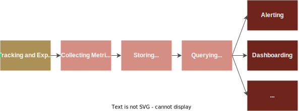
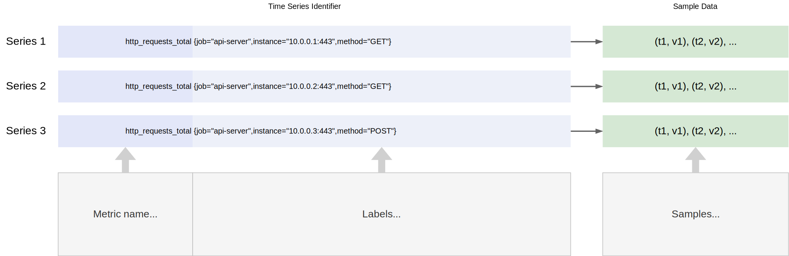

# 02 — Prometheus

---

## 目錄

- [02 — Prometheus](#02--prometheus)
  - [目錄](#目錄)
  - [Prometheus 是什麼？ (pruh·mee·thee·uhs)](#prometheus-是什麼-pruhmeetheeuhs)
  - [Pull-based vs. Push-based](#pull-based-vs-push-based)
    - [Pull 的優勢](#pull-的優勢)
    - [Prometheus 不做哪些事？](#prometheus-不做哪些事)
  - [系統架構](#系統架構)
    - [Core Components](#core-components)
    - [架構圖](#架構圖)
      - [一個被監控的target可以是](#一個被監控的target可以是)
    - [流程](#流程)
  - [](#)
  - [Time Series 資料模型](#time-series-資料模型)
    - [什麼是 Time Series？](#什麼是-time-series)
    - [資料的組成部分](#資料的組成部分)
  - [把 Prometheus 跑起來](#把-prometheus-跑起來)
    - [事前準備](#事前準備)
    - [Step 1：/examples 裡有什麼？](#step-1examples-裡有什麼)
    - [Step 2：啟動整個 stack](#step-2啟動整個-stack)
  - [小結](#小結)

---

## Prometheus 是什麼？ (pruh·mee·thee·uhs)

**Prometheus** 是一套開源的 monitoring 和 alerting 工具，由 SoundCloud 於 2012 年開發，2016 年成為 CNCF（Cloud Native Computing Foundation）的第二個Project（僅次於 Kubernetes）。

Prometheus 的兩大特色：

1. **Pull-based 架構** — 主動去服務端拉取 metrics，而非被動等待
2. **內建 Time Series 資料庫（TSDB）** — 有效儲存時間序列資料

---

## Pull-based vs. Push-based

大多數的 monitoring 系統是「被動」的——等服務主動把資料 push 過來。Prometheus 則是「主動出擊」
它會依照固定的時間間隔，主動去各個服務 pull（scrape）metrics。

```
Push-based（傳統做法）:
  Service ──推送資料──▶ Monitoring System
  Service ──推送資料──▶ Monitoring System
  Service ──推送資料──▶ Monitoring System

Pull-based（Prometheus）:
  Prometheus ──「你還好嗎？」──▶ Service A
  Prometheus ──「你還好嗎？」──▶ Service B
  Prometheus ──「你還好嗎？」──▶ Service C
```

### Pull 的優勢

| 面向 | Pull-based（Prometheus） | Push-based（傳統做法） |
|------|------------------------|-------------------|
| **Shutdown偵測** | 服務沒回應 scrape = 立刻知道掛了 | 服務掛了就不會 push，可能很久才發現 |
| **服務端設定** | 服務只需要 expose `/metrics`，不用知道 monitoring 的位置 | 服務需要設定 push 的目標地址 |
| **流量控制** | Prometheus 決定 scrape 頻率，不會被大量 push 淹沒 | 大量服務同時 push 可能造成 monitoring 系統過載 |
| **除錯方便** | 可以直接瀏覽器打開服務的 `/metrics` endpoint 查看 | 資料推送後才看得到 |

* Pull-based 就像醫生每 30 分鐘固定巡房一次（主動檢查）
* Push-based 就像等病人按鈴才去看（被動等待）

---
### Prometheus 不做哪些事？
Prometheus 主要針對基於數值metrics（time series）的監控，並具備簡單的架構與明確的警報規則。

它不解決以下問題：
* 日誌 (logs) 或個別事件 (events)（帶有timestamp且詳細的個別事件紀錄）的儲存與處理
* 追蹤 (traces)（追蹤單一使用者請求在多個系統間的生命週期）的儲存與處理
* 基於 Machine learning 或 AI 的異常偵測
* 可水平擴展的叢集儲存 (clustered storage)

---

## 系統架構

### Core Components

我們今天要介紹的 monitoring 系統由四個元件組成:

| 元件 | 負責什麼 | 類比 |
|------|---------|------|
| **Prometheus** | 蒐集 metrics、儲存 time series、評估 alert rules | 醫院的監測儀器 |
| **Exporter** | 把服務的內部指標轉換成 Prometheus 可讀的格式 | 量體溫的溫度計 |
| **Alertmanager** | 接收 alerts，分組、去重複、Route通知 | 醫院的廣播叫號系統 |
| **Grafana** | 查詢 Prometheus 資料，顯示視覺化 Dashboard | 病房裡的生理數值螢幕 |

### 架構圖


#### 一個被監控的target可以是
* An **Instrumented application**：可以直接被追蹤並暴露關於自身指標的應用程式
* An **Exporter**: 這是一種middleware，負責將現有系統（例如：資料庫伺服器、Linux 主機或網路設備）的指標轉換或生成為 Prometheus的指標expose的格式
---

### 流程

---

## Time Series 資料模型

### 什麼是 Time Series？

在 Prometheus 中，所有的 metrics 都以 **time series**（時間序列）的形式儲存。一筆 time series 就是一連串帶有時間戳記的數值。

```
http_requests_total{service="api", env="prod"} @ 14:00:00 = 1000
http_requests_total{service="api", env="prod"} @ 14:00:30 = 1042
http_requests_total{service="api", env="prod"} @ 14:01:00 = 1089
http_requests_total{service="api", env="prod"} @ 14:01:30 = 1120
```


### 資料的組成部分

每一筆 time series 資料包含三個部分：

```
http_requests_total{service="api", env="prod"} @ 14:00:00  =  1000
└──────┬─────────┘ └──────────┬───────────┘   └─────┬────┘   └─┬─┘
   Metric Name            Labels              Sample (Timestamp + Value)
```

| 組成部分 | 說明 | 範例 |
|---------|------|------|
| **Metric Name** | 量測的指標名稱 | `http_requests_total` |
| **Labels** | 一組 key-value pairs，用來區分同名 metric 的不同維度 | `service="api"`, `env="prod"` |
| **Timestamp** | 這筆資料是什麼時候記錄的 | `14:00:00` |
| **Value** | 實際量測到的數值（64-bit 浮點數） | `1000` |

---

## 把 Prometheus 跑起來

到這裡我們已經知道 Prometheus 是什麼、架構長什麼樣子、資料怎麼存。接下來在進入 metric 類型和 PromQL 之前，先把整個 stack 跑起來，範例查詢才有真實的資料可以對照。

完整的範例 stack 放在 `Prometheus/examples/`

### 事前準備

在 Docker 課程中已經安裝了 Docker、Docker Compose、git。確認它們能正常使用：

```bash
docker --version
docker compose version
```

建議也裝一個瀏覽器擴充功能，讓 `/metrics` 的原始輸出比較好讀：

- [Prometheus Formatter Extension](https://chromewebstore.google.com/detail/jhfbpphccndhifmpfbnpobpclhedckbb?utm_source=item-share-cb)


裝之後有縮排、顏色、可以收折：


### Step 1：/examples 裡有什麼？

先用 `ls` 看一眼：

```
Prometheus/examples/
├── docker-compose.yml        # 把下面所有服務串在一起
├── prometheus/
│   ├── prometheus.yml        # scrape 設定 + alerting 指向 alertmanager
│   ├── alert_rules.yml       # 告警規則（下一章會用到）
│   ├── alertmanager.yml      # Alertmanager 設定（下一章會用到）
│   └── secrets/              # Discord webhook 的 secret 放這裡（gitignored）
└── grafana/
    └── provisioning/         # Grafana data sources + dashboard 預載
```

示範用的 Go 服務其實在前面的 CI/CD 目錄下（`CI-CD/examples/sample-app/`），docker-compose.yml 用跨目錄的 build context（`build: ../../CI-CD/examples/sample-app`）把它帶進來。

下一章會深入這個 Go 服務和 `prometheus/prometheus.yml`。

### Step 2：啟動整個 stack

```bash
docker compose up -d
```

確認每個 service 都在跑：

```bash
docker compose ps
```

你應該看到 5 個 services：`app`、`prometheus`、`node-exporter`、`alertmanager`、`grafana`。如果有哪個不是 **running**，用 `docker compose logs <service-name>` 看一下。

> **Port 對照表**
>
> | 服務 | URL |
> |------|-----|
> | Go app | http://localhost:8000 |
> | Prometheus | http://localhost:9090 |
> | Node Exporter | http://localhost:9100 |
> | Alertmanager | http://localhost:9093 |
> | Grafana | http://localhost:3000 |

---

## 小結

- **Prometheus** 是 Pull-based 的 monitoring 系統，主動去服務端拉取 metrics
- 系統架構包含四大 Components：**Prometheus**（蒐集）、**Exporter**（讀 metrics）、**Alertmanager**（告警）、**Grafana**（視覺化）
- 所有 metrics 以 **time series** 形式儲存，包含 metric name + labels + timestamp + value
- `examples/` 下面的 Docker Compose stack 已經把整套環境準備好，`docker compose up -d` 就能跑起來

下一章會從這個跑起來的 stack 出發，看服務怎麼 expose metrics、Prometheus 怎麼抓下來，並介紹 metric 的四種類型、Labels、PromQL。

---

[← 上一章：Monitoring 概念介紹](01-monitoring-intro.md) ｜ [下一章：動手做：Metrics 與 PromQL →](03-first-prometheus.md)
