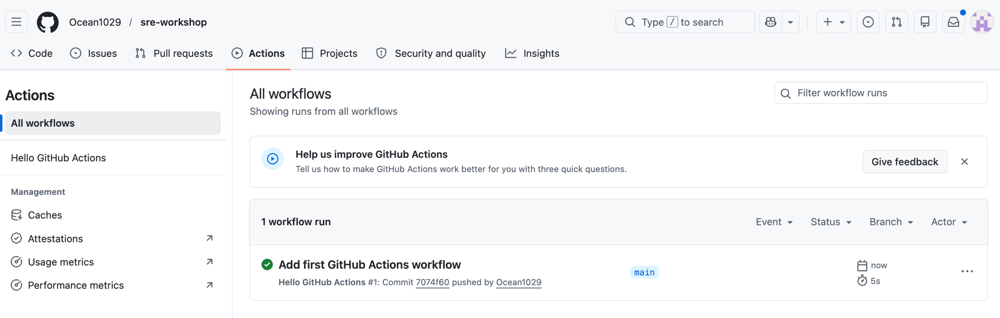
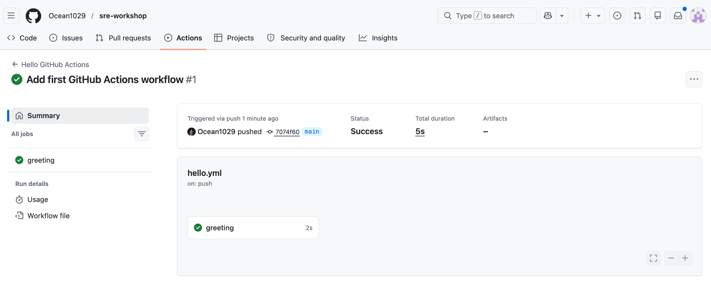
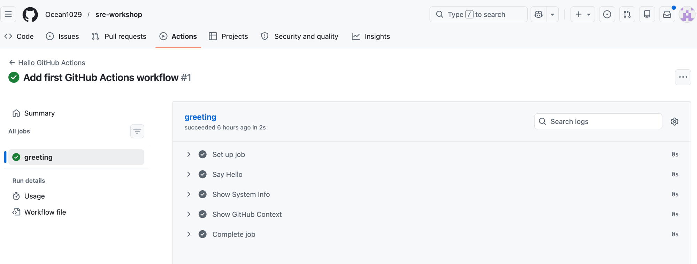
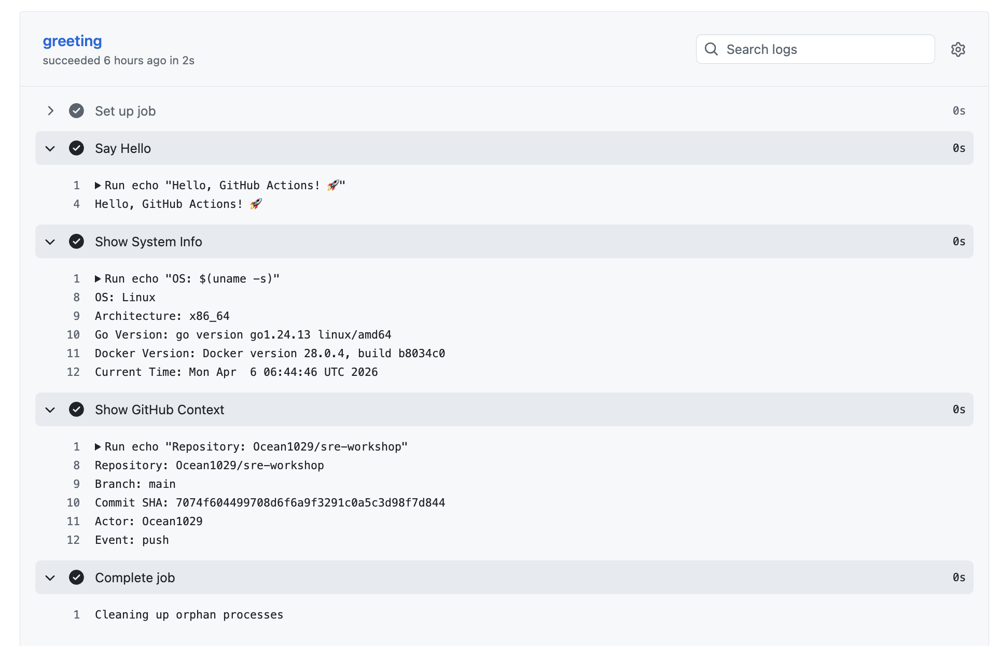

# 02 — GitHub Actions

## 目錄

- [事前準備](#事前準備)
- [先跑一個 Workflow](#先跑一個-workflow)
- [GitHub Actions 介面](#github-actions-介面)
- [回頭看：剛剛的 Workflow 在做什麼](#回頭看剛剛的-workflow-在做什麼)
- [手動觸發與失敗處理](#手動觸發與失敗處理)
- [常見 Events（觸發器）](#常見-events觸發器)
- [常見 Actions](#常見-actions)
- [Context 與表達式](#context-與表達式)
- [環境變數](#環境變數)
- [GitHub-hosted Runners](#github-hosted-runners)
- [免費額度與限制](#免費額度與限制)
- [YAML 語法速查](#yaml-語法速查)
- [GITHUB_TOKEN](#github_token)
- [常見問題排解](#常見問題排解)
- [小結](#小結)


## 事前準備

### 確認你的 GitHub 帳號

請確認你已經擁有一個 GitHub 帳號。如果還沒有，請前往 [github.com](https://github.com) 註冊一個。

### 建立一個新的 GitHub Repository

我們需要一個全新的 repository 來練習。請依照以下步驟操作：

1. 登入 GitHub 後，點擊右上角的 **「+」** 按鈕，選擇 **「New repository」**
2. 填寫 repository 資訊：
   - **Repository name**：輸入 `github-actions-lab`
   - **Description**（選填）：輸入 `My first GitHub Actions workflow`
   - **Visibility**：選擇 **Public**
3. 點擊 **「Create repository」** 按鈕

### 將 Repository Clone 到本機

打開終端機，執行以下指令：

```bash
# Replace <your-username> with your GitHub username
git clone https://github.com/<your-username>/github-actions-lab.git
cd github-actions-lab
```


## 先跑一個 Workflow

先不用管每一行在幹嘛，照著貼就好，我們等一下會回來解釋。

### 建立目錄結構

GitHub Actions 的 workflow 檔案必須放在 `.github/workflows/` 目錄下。我們先來建立這個目錄：

```bash
mkdir -p .github/workflows
```

### 建立 Workflow 檔案

在 `.github/workflows/` 目錄下建立一個名為 `hello.yml` 的檔案：

```bash
# You can use any editor you prefer
vim .github/workflows/hello.yml
```

將以下內容貼入進入編輯器，完成後你可以打 `:wq` 離開 vim：

```yaml
name: Hello GitHub Actions

on:
  push:
    branches: [main]
  workflow_dispatch:

jobs:
  greeting:
    runs-on: ubuntu-latest
    steps:
      - name: Say Hello
        run: echo "Hello, GitHub Actions! 🚀"

      - name: Show System Info
        run: |
          echo "OS: $(uname -s)"
          echo "Architecture: $(uname -m)"
          echo "Go Version: $(go version)"
          echo "Docker Version: $(docker --version)"
          echo "Current Time: $(date)"

      - name: Show GitHub Context
        run: |
          echo "Repository: ${{ github.repository }}"
          echo "Branch: ${{ github.ref_name }}"
          echo "Commit SHA: ${{ github.sha }}"
          echo "Actor: ${{ github.actor }}"
          echo "Event: ${{ github.event_name }}"
```

### Push 到 GitHub

```bash
git add .github/workflows/hello.yml
git commit -m "Add first GitHub Actions workflow"
git push origin main
```


## GitHub Actions 介面

打開瀏覽器，進入你的 GitHub repository 頁面，點擊上方的 **「Actions」** 分頁（如果看不到，請確認檔案已成功 push）。你應該會看到一個正在執行的 workflow run，名稱為前面的 Commit message **「Add first GitHub Actions workflow」**




點進去之後，你會看到這次 workflow run 的詳細資訊：



- **Summary**：這次 run 的摘要，包括觸發方式、commit SHA、狀態、執行時間
- **Job 列表**：左側會顯示這次 run 包含的所有 job（我們只有一個 `greeting` job）

點開 **greeting** job，你會看到這個 job 裡每個 step 的執行紀錄：



每個步驟都有打勾符號代表該步驟執行成功，你可以點擊任何一個步驟可以展開查看詳細的輸出內容：



試著看一下 **Show System Info**，你會發現 Runner 上已經預裝了 Go 和 Docker，並可以從中得知他們的版本。

## 回頭看：剛剛的 Workflow 在做什麼

OK，你已經成功跑完第一個 workflow 了。現在我們回頭看剛剛那個 `hello.yml`，用它來認識 GitHub Actions 的六個核心概念。

### 1. Workflow

**Workflow** 是一個定義自動化流程的 **YAML 檔案**。剛剛那個 `hello.yml` 就是一個 workflow。

- 檔案位置：必須放在 repository 的 **`.github/workflows/`** 目錄下
- 副檔名：`.yml` 或 `.yaml`
- 一個 repository 可以有 **多個** workflow

```
my-repo/
├── .github/
│   └── workflows/
│       ├── ci.yml    
│       ├── pr-check.yml     
│       └── release.yml      
├── main.go
└── go.mod
```

### 2. Event

**Event** 是觸發 workflow 執行的條件。在剛剛的 `hello.yml` 裡，我們定義了兩個 event：

```yaml
on:
  push:
    branches: [main]
  workflow_dispatch:
```

- `push: branches: [main]` — 當有程式碼被 push 到 `main` 分支時自動觸發（剛剛就是靠這個觸發的）
- `workflow_dispatch` — 允許在 GitHub UI 上手動觸發（等一下會用到）

常見事件還包括：

- 建立或更新 Pull Request（`pull_request`）
- 定時排程（`schedule`）

### 3. Job

**Job** 是 workflow 中的 **執行單元**。在剛剛的 `hello.yml` 裡，我們只有一個 job 叫做 `greeting`：

```yaml
jobs:
  greeting:
    runs-on: ubuntu-latest
```

關於 Job 的重點：

在剛剛的 `hello.yml` 裡，我們只有一個 job 叫 `greeting`。但一個 workflow 可以有多個 job：

- 預設情況下，多個 job **平行執行**
- 可以透過 `needs` 關鍵字設定 job 之間的 **依賴關係**，使其依序執行
- 每個 job 在一個獨立的 **Runner** 環境中執行

假設我們把 `hello.yml` 擴充成三個 job：

```yaml
jobs:
  greeting:
    runs-on: ubuntu-latest
    steps:
      - run: echo "Hello, GitHub Actions! 🚀"

  system-info:
    runs-on: ubuntu-latest
    steps:
      - run: echo "OS: $(uname -s)"

  # This job waits for both greeting and system-info to finish
  summary:
    needs: [greeting, system-info]
    runs-on: ubuntu-latest
    steps:
      - run: echo "All done!"
```

這樣 `greeting` 和 `system-info` 會同時跑，`summary` 會等前兩個都完成才執行。

### 4. Step

**Step** 就是 job 裡面的每一個步驟，一個 step 做一件事。在剛剛的 `hello.yml` 裡，`greeting` job 有三個 step：`Say Hello`、`Show System Info`、`Show GitHub Context`。

- 每個 step 依序執行（同一個 job 內的 step 不能平行運作）
- Step 有兩種形式：
  - **`uses`**：使用一個現成的 Action
  - **`run`**：執行一段 shell 指令
- 同一個 job 內的 step 共享 **相同的檔案系統**

```yaml
steps:
  # Step 1: use an existing action
  - uses: actions/checkout@v4

  # Step 2: run a shell command
  - name: Run tests
    run: go test ./...

  # Step 3: use another action
  - uses: actions/upload-artifact@v4
    with:
      name: test-results
      path: results/
```

### 5. Action

**Action** 是一個 **可重用的步驟**，別人已經寫好的功能，你拿來直接用就好。

舉例來說，Ocean 每次寫 workflow 都需要先把程式碼 checkout 下來，再安裝 Go，再跑 lint。這些步驟不用自己從頭寫，直接用社群提供的 Action 就搞定了。

在剛剛的 `hello.yml` 裡，我們沒有用到 `uses`（只用了 `run`），但在後面的章節你會大量使用 Action。

- 來源：
  - **GitHub Marketplace**：社群提供的現成 Actions（如 `actions/checkout`）
  - **自訂 Action**：自己撰寫的 Action（放在 repository 中）
- 引用格式：`{owner}/{repo}@{version}`
  - 例如：`actions/checkout@v4`
  - 建議固定版本（用 `@v4` 而非 `@main`），避免未預期的變更

### 6. Runner

**Runner** 是實際執行 job 的 **機器環境**。在剛剛的 `hello.yml` 裡，`runs-on: ubuntu-latest` 代表我們使用 GitHub 提供的最新版 Ubuntu 虛擬機。

- **GitHub-hosted Runner**：GitHub 提供的雲端虛擬機，用完即丟
  - 不需要自己管理伺服器
  - 提供 Ubuntu、Windows、macOS 等作業系統
- **Self-hosted Runner**：你自己管理的機器
  - 適用於需要特殊硬體、軟體或網路環境的場景
  - 需要自行維護與更新

本課程使用 **GitHub-hosted Runner**，不需要額外設定。

### 概念關係圖

以下是 GitHub Actions 各概念之間的階層關係：

```
┌─────────────────────────────────────────────────────────────┐
│                        Workflow                             │
│                  (.github/workflows/ci.yml)                 │
│                                                             │
│  ┌───────────────────────────────────────────────────────┐  │
│  │ Event                                                 │  │
│  │ on: push, pull_request, schedule ...                  │  │
│  └───────────────────────────────────────────────────────┘  │
│                                                             │
│  ┌─────────────────────────┐  ┌─────────────────────────┐   │
│  │ Job 1: build            │  │ Job 2: deploy           │   │
│  │ (runs-on: ubuntu-latest)│  │ (needs: build)          │   │
│  │                         │  │                         │   │
│  │  ├── Step 1             │  │  ├── Step 1             │   │
│  │  │   uses: action       │  │  │   uses: action       │   │
│  │  ├── Step 2             │  │  └── Step 2             │   │
│  │  │   run: command       │  │      run: command       │   │
│  │  └── Step 3             │  │                         │   │
│  │      uses: action       │  │                         │   │
│  └─────────────────────────┘  └─────────────────────────┘   │
│        │                             ▲                      │
│        └─────── needs ───────────────┘                      │
└─────────────────────────────────────────────────────────────┘
```

用樹狀結構來看更清楚：

```
Workflow (.github/workflows/ci.yml)
├── Event 
│   └── on: push (branches: [main])
├── Job 1: build
│   ├── runs-on: ubuntu-latest
│   ├── Step 1 — uses: actions/checkout@v4
│   ├── Step 2 — run: go build ./...
│   └── Step 3 — uses: actions/upload-artifact@v4
└── Job 2: deploy
    ├── needs: [build]
    ├── runs-on: ubuntu-latest
    ├── Step 1 — uses: actions/checkout@v4
    └── Step 2 — run: ./deploy.sh
```


## 手動觸發與失敗處理

### 手動觸發 Workflow

#### 什麼是 `workflow_dispatch`？

還記得我們在 `on:` 中定義了 `workflow_dispatch` 嗎？這個觸發器允許你 **不需要 push 程式碼**，就能直接在 GitHub UI 上手動觸發 workflow。

這在以下場景非常實用：

- 手動重新執行失敗的 pipeline
- 測試 workflow 設定是否正確
- 觸發不需要程式碼變更的維運作業（例如：手動清理暫存檔案）

#### 手動觸發步驟

1. 前往你的 repository 的 **Actions** 分頁
2. 在左側邊欄找到 **「Hello GitHub Actions」** workflow
3. 點擊它，你會看到右上方出現一個 **「Run workflow」** 按鈕
4. 點擊 **「Run workflow」**，選擇 branch 為 `main`，然後按下綠色的 **「Run workflow」** 按鈕
5. 等待幾秒鐘，頁面會出現新的 workflow run

觀察這次手動觸發的結果，點開 **Show GitHub Context** 步驟，你會發現 `Event` 欄位顯示的是 `workflow_dispatch`，而不是上次的 `push`。

### 製造一個失敗

#### 為什麼要故意製造失敗？

在實際開發中，CI pipeline 失敗是常態。了解失敗時的表現可以幫助你快速排除問題。

#### 修改 Workflow

編輯 `.github/workflows/hello.yml`，在 `steps` 最後面加入一個 **一定會失敗** 的步驟：

```yaml
      - name: This Step Will Fail
        run: |
          echo "About to fail..."
          exit 1
```

`exit 1` 代表以 **非零的退出碼** 結束，shell 會將其視為錯誤。

修改完的 `hello.yml` 完整內容如下：

```yaml
name: Hello GitHub Actions

on:
  push:
    branches: [main]
  workflow_dispatch:

jobs:
  greeting:
    runs-on: ubuntu-latest
    steps:
      - name: Say Hello
        run: echo "Hello, GitHub Actions! 🚀"

      - name: Show System Info
        run: |
          echo "OS: $(uname -s)"
          echo "Architecture: $(uname -m)"
          echo "Go Version: $(go version)"
          echo "Docker Version: $(docker --version)"
          echo "Current Time: $(date)"

      - name: Show GitHub Context
        run: |
          echo "Repository: ${{ github.repository }}"
          echo "Branch: ${{ github.ref_name }}"
          echo "Commit SHA: ${{ github.sha }}"
          echo "Actor: ${{ github.actor }}"
          echo "Event: ${{ github.event_name }}"

      - name: This Step Will Fail
        run: |
          echo "About to fail..."
          exit 1
```

#### Push 並觀察失敗結果

```bash
git add .github/workflows/hello.yml
git commit -m "Add a failing step to test error handling"
git push origin main
```

前往 Actions 分頁，你會看到：

- Workflow run 旁邊會出現一個 **紅色叉叉** ❌
- 點進去查看，前面的步驟仍然是 ✅，但最後一個步驟會顯示 ❌
- 點開失敗的步驟，可以看到錯誤訊息：`Error: Process completed with exit code 1.`

**重要觀念**：當某個 step 失敗時，**後續的 step 預設不會執行**，整個 job 會被標記為失敗。

#### 修復並重新 Push

了解失敗的表現後，讓我們把失敗的步驟移除（或註解掉），恢復正常：

```yaml
      # - name: This Step Will Fail
      #   run: |
      #     echo "About to fail..."
      #     exit 1
```

或者直接刪除那個步驟，然後 push：

```bash
git add .github/workflows/hello.yml
git commit -m "Remove failing step"
git push origin main
```

回到 Actions 分頁，確認新的 workflow run 又回到 **綠色勾勾** ✅。


## 常見 Events（觸發器）

| Event | 觸發時機 | 範例 |
|-------|---------|------|
| `push` | 推送程式碼到指定分支時 | `on: push` / `on: push: branches: [main]` |
| `pull_request` | 建立或更新 PR 時 | `on: pull_request: branches: [main]` |
| `schedule` | 定時排程（cron 語法） | `on: schedule: - cron: '0 0 * * *'` |
| `workflow_dispatch` | 手動觸發（在 Actions 頁面按按鈕） | `on: workflow_dispatch` |
| `release` | 建立 Release 時 | `on: release: types: [published]` |
| `issues` | Issue 被建立或修改時 | `on: issues: types: [opened]` |
| `workflow_run` | 另一個 workflow 完成後觸發 | `on: workflow_run: workflows: [CI]` |

### 事件篩選

你可以進一步篩選觸發條件，只在特定情況下才執行：

```yaml
on:
  push:
    # Only trigger on specific branches
    branches: [main, develop]
    # Only trigger when specific files change
    paths:
      - 'src/**'
      - '*.go'
    # Ignore specific paths
    paths-ignore:
      - 'docs/**'
      - '*.md'

  pull_request:
    # Only trigger on specific event types
    types: [opened, synchronize, reopened]
    branches: [main]
```

## 常見 Actions

以下是你會經常用到的官方 Actions：

### actions/checkout

**用途**：將 repository 的程式碼下載到 Runner 上。幾乎每個 workflow 的第一步都是這個。

```yaml
- uses: actions/checkout@v4
```

### actions/setup-go

**用途**：安裝指定版本的 Go 語言環境。

```yaml
- uses: actions/setup-go@v5
  with:
    go-version: '1.24'
```

### actions/cache

**用途**：快取依賴套件，加速後續的建置。

```yaml
- uses: actions/cache@v4
  with:
    path: ~/go/pkg/mod
    key: ${{ runner.os }}-go-${{ hashFiles('**/go.sum') }}
    restore-keys: |
      ${{ runner.os }}-go-
```

### actions/upload-artifact

**用途**：將建置產出的檔案上傳為 artifact，供下載或傳給其他 job 使用。

```yaml
- uses: actions/upload-artifact@v4
  with:
    name: my-binary
    path: ./build/app
```

### actions/download-artifact

**用途**：下載先前上傳的 artifact（通常在不同的 job 中使用）。

```yaml
- uses: actions/download-artifact@v4
  with:
    name: my-binary
    path: ./build/
```

### 如何尋找更多 Actions？

前往 [GitHub Marketplace](https://github.com/marketplace?type=actions) 搜尋你需要的功能。在搜尋時，注意以下幾點：

- 優先選擇有 **Verified Creator** 標章的 Action
- 查看 **星星數** 和 **使用人數**
- 確認 Action 的 **最後更新時間**，避免使用已停止維護的 Action
- 閱讀 Action 的 README，了解所有可用參數


## Context 與表達式

### `${{ }}` 表達式語法

在 GitHub Actions 中，`${{ }}` 是一種特殊語法，用來存取 **context 物件** 的資訊。GitHub 在 workflow 執行時會自動提供這些資訊。

```yaml
# Basic usage
run: echo "Hello, ${{ github.actor }}!"

# Use in conditionals
if: ${{ github.ref == 'refs/heads/main' }}

# Use in environment variables
env:
  REPO_NAME: ${{ github.repository }}
```

### 常用的 Context

#### `github` context

提供 workflow run 的相關資訊，是最常用的 context：

| 表達式 | 說明 | 範例值 |
|--------|------|--------|
| `github.repository` | Repository 全名 | `octocat/hello-world` |
| `github.ref` | 完整的 Git ref | `refs/heads/main` |
| `github.ref_name` | 分支或 tag 名稱 | `main` |
| `github.sha` | 觸發 commit 的完整 SHA | `abc123def456...` |
| `github.actor` | 觸發事件的使用者 | `octocat` |
| `github.event_name` | 觸發的事件名稱 | `push`、`pull_request` |
| `github.run_number` | Workflow 的執行序號 | `42` |
| `github.workspace` | Runner 上的工作目錄路徑 | `/home/runner/work/repo/repo` |

#### `env` context

用來存取在 workflow 中定義的環境變數（下一節會詳細介紹）：

```yaml
env:
  MY_VAR: hello

steps:
  - run: echo "${{ env.MY_VAR }}"
```

#### `secrets` context

用來存取在 repository 中設定的 **機密資訊**（如 API Key、Token 等）。Secrets 的內容在 log 中會自動被遮蔽，不會外洩。

```yaml
steps:
  - name: Deploy
    run: ./deploy.sh
    env:
      API_KEY: ${{ secrets.API_KEY }}
```

> 我們會在後面的章節詳細介紹如何設定和使用 secrets。現在只需要知道它的存在即可。

#### `runner` context

提供 Runner 環境的相關資訊：

| 表達式 | 說明 | 範例值 |
|--------|------|--------|
| `runner.os` | 作業系統 | `Linux`、`Windows`、`macOS` |
| `runner.arch` | 架構 | `X64`、`ARM64` |
| `runner.temp` | 暫存目錄路徑 | `/home/runner/work/_temp` |


## 環境變數

### 環境變數的三個層級

在 GitHub Actions 中，你可以在三個不同的層級設定環境變數，每個層級的 **作用範圍** 不同：

```yaml
name: Environment Variables Demo

on:
  push:
    branches: [main]

# Workflow-level: available to ALL jobs and ALL steps
env:
  APP_NAME: my-awesome-app
  ENVIRONMENT: production

jobs:
  demo:
    runs-on: ubuntu-latest

    # Job-level: available to ALL steps in THIS job only
    env:
      LOG_LEVEL: debug
      DATABASE_HOST: localhost

    steps:
      - name: Show All Variables
        # Step-level: available to THIS step only
        env:
          STEP_VAR: "I only exist in this step"
        run: |
          echo "App Name: $APP_NAME"
          echo "Environment: $ENVIRONMENT"
          echo "Log Level: $LOG_LEVEL"
          echo "Database Host: $DATABASE_HOST"
          echo "Step Var: $STEP_VAR"

      - name: Step Var Is Gone
        run: |
          echo "App Name: $APP_NAME"
          echo "Log Level: $LOG_LEVEL"
          echo "Step Var: $STEP_VAR"
          # STEP_VAR will be empty here because it was defined in the previous step
```

### 三個層級的作用範圍比較

| 層級 | 設定位置 | 作用範圍 |
|------|---------|---------|
| **Workflow level** | `on:` 同層的 `env:` | 所有 job 的所有 step 都能使用 |
| **Job level** | `jobs.<job_id>:` 底下的 `env:` | 該 job 內的所有 step 能使用 |
| **Step level** | `steps[*]:` 底下的 `env:` | 僅限該 step 能使用 |

**優先順序**：如果不同層級定義了相同名稱的環境變數，**越小範圍的優先**（Step > Job > Workflow）。

### 範例：環境變數的覆蓋

```yaml
env:
  MESSAGE: "I'm from workflow level"

jobs:
  demo:
    runs-on: ubuntu-latest
    env:
      MESSAGE: "I'm from job level"
    steps:
      - name: Check Message
        env:
          MESSAGE: "I'm from step level"
        run: echo "$MESSAGE"
        # Output: I'm from step level
```


## GitHub-hosted Runners

GitHub 提供免費的雲端 Runner，不需要自行架設伺服器。

### 可用的作業系統

| Runner 標籤 | 作業系統 | 說明 |
|-------------|---------|------|
| `ubuntu-latest` | Ubuntu (最新 LTS) | 最常用，建議預設選擇 |
| `ubuntu-24.04` | Ubuntu 24.04 | 指定特定 Ubuntu 版本 |
| `windows-latest` | Windows Server | 需要 Windows 環境時使用 |
| `macos-latest` | macOS | 需要 macOS 環境時使用（例如 iOS 開發） |

> `*-latest` 標籤對應的實際版本會隨時間更新，請參考 [GitHub 官方文件](https://docs.github.com/en/actions/using-github-hosted-runners/using-github-hosted-runners/about-github-hosted-runners) 確認目前的版本。

### 預裝的軟體

GitHub-hosted Runner 已預裝大量常用軟體，包括：

- **語言**：Go、Node.js、Python、Java、Ruby、Rust 等
- **套件管理器**：npm、pip、gem 等
- **工具**：Git、Docker、docker compose、curl、wget、jq 等
- **雲端 CLI**：AWS CLI、Azure CLI、Google Cloud SDK 等

> 完整清單請參考 [GitHub 官方文件](https://github.com/actions/runner-images)。

### 資源限制

| 項目 | 限制 |
|------|------|
| vCPU | 2 核（Linux/Windows）/ 3 核（macOS） |
| 記憶體 | 7 GB（Linux/Windows）/ 14 GB（macOS） |
| 磁碟空間 | 14 GB（SSD） |


## 免費額度與限制

### 費用方案

| 方案 | 免費額度 |
|------|---------|
| **公開（Public）Repository** | 完全免費，無分鐘數限制 |
| **私人（Private）Repository — Free 方案** | 每月 2,000 分鐘 |
| **私人（Private）Repository — Pro 方案** | 每月 3,000 分鐘 |
| **私人（Private）Repository — Team 方案** | 每月 3,000 分鐘 |

> **注意**：不同作業系統的分鐘數消耗倍率不同。Linux = 1x、Windows = 2x、macOS = 10x。

### 執行時間限制

| 項目 | 限制 |
|------|------|
| 單次 job 最長執行時間 | **6 小時** |
| 單次 workflow 最長執行時間 | **35 天**（通常用於含有 approval 等待的 workflow） |
| API 請求頻率 | 每個 repository 每小時 1,000 次 |
| 同時執行的 job 數量 | Free 方案最多 20 個 |

## YAML 語法速查

GitHub Actions 的 workflow 使用 YAML 格式。如果你不熟悉 YAML，以下是快速入門：

### 縮排規則

YAML 使用 **空格**（space）進行縮排，**不能用 Tab**。通常使用 **2 個空格** 為一層縮排。

```yaml
# Good — using spaces
parent:
  child:
    grandchild: value

# Bad — using tabs (will cause errors!)
parent:
	child:           # ← This is a tab, YAML will reject this
```

### Key-Value Pairs（鍵值對）

```yaml
name: My Workflow
version: 1.0
enabled: true
count: 42
```

### 列表（List）

```yaml
# Block style
fruits:
  - apple
  - banana
  - cherry

# Inline style
fruits: [apple, banana, cherry]
```

### 巢狀結構

```yaml
jobs:
  build:
    runs-on: ubuntu-latest
    steps:
      - name: Checkout
        uses: actions/checkout@v4
      - name: Build
        run: go build ./...
```

### 多行字串

```yaml
# Literal block (preserves newlines)
description: |
  This is line 1.
  This is line 2.
  This is line 3.

# Folded block (joins lines with spaces)
description: >
  This is a long sentence
  that will be joined
  into a single line.
```

### 變數引用

在 GitHub Actions 中，使用 `${{ }}` 語法引用變數：

```yaml
steps:
  - name: Print info
    run: |
      echo "Repository: ${{ github.repository }}"
      echo "Branch: ${{ github.ref_name }}"
      echo "Actor: ${{ github.actor }}"

  - name: Use secrets
    run: echo "Token is set"
    env:
      MY_TOKEN: ${{ secrets.MY_SECRET_TOKEN }}
```


## GITHUB_TOKEN

`secrets.GITHUB_TOKEN` 是 GitHub 在每次 workflow 執行時自動產生的臨時 token，不需要你手動設定。它的預設權限取決於 repository 的設定，但你可以在 workflow 中用 `permissions` 關鍵字明確限縮權限。

重點：

- 這個 token 在 workflow 結束後就會失效
- 它的權限只限於觸發 workflow 的 repository
- 如果你需要存取其他 repository，就需要使用 Personal Access Token (PAT)
- 建議在每個 workflow 中都明確設定 `permissions`，遵循最小權限原則


## 常見問題排解

在第一次撰寫 workflow 時，以下是最常見的幾個問題：

### 1. YAML 縮排錯誤

YAML 對縮排非常敏感，必須使用 **空格（space）**，**不能使用 Tab**。

**常見錯誤訊息**：

```
Invalid workflow file: .github/workflows/hello.yml
  - yaml: line X: mapping values are not allowed in this context
```

**排解方式**：

- 確認你的編輯器設定為使用空格縮排（建議 2 個空格）
- 在 VS Code 中，右下角可以看到目前的縮排設定（`Spaces: 2`），點擊可以切換
- 使用線上 YAML 驗證工具（如 [yamllint.com](https://www.yamllint.com/)）檢查語法

```yaml
# Wrong — mixed indentation
jobs:
  build:
    runs-on: ubuntu-latest
    steps:
      - name: Test
       run: echo "wrong indent"    # ← only 1 space, should be 2

# Correct
jobs:
  build:
    runs-on: ubuntu-latest
    steps:
      - name: Test
        run: echo "correct indent"  # ← 2 spaces from the dash
```

### 2. 檔案路徑錯誤

Workflow 檔案 **必須** 放在 `.github/workflows/` 目錄下，路徑大小寫也要正確。

**常見錯誤**：

| 錯誤路徑 | 說明 |
|----------|------|
| `github/workflows/hello.yml` | 少了前面的「.」 |
| `.github/workflow/hello.yml` | `workflows` 少了 `s` |
| `.Github/Workflows/hello.yml` | 大小寫錯誤 |
| `.github/workflows/hello.yaml` | 副檔名 `.yaml` 其實可以，但要確認一致 |

### 3. 權限問題

如果你的 repository 是新建的或剛 fork 的，可能需要確認 Actions 權限：

1. 前往 repository 的 **Settings** → **Actions** → **General**
2. 在 **Actions permissions** 區塊，選擇 **「Allow all actions and reusable workflows」**
3. 在 **Workflow permissions** 區塊，確認權限設定為 **「Read and write permissions」**（後面章節會用到寫入權限）

### 4. 分支名稱不符

如果你的 repository 預設分支是 `master` 而非 `main`，workflow 的 `branches: [main]` 不會被觸發。

**排解方式**：確認你的預設分支名稱，並修改 workflow 中的 `branches` 設定：

```yaml
on:
  push:
    branches: [master]  # ← change to match your default branch
```


## 小結

- **GitHub Actions** 是 GitHub 內建的 CI/CD 平台，用 YAML 檔案定義自動化流程
- 六個核心概念：**Workflow → Event → Job → Step → Action → Runner**
- Workflow 檔案放在 **`.github/workflows/`** 目錄下
- 透過 **Event** 決定何時觸發，透過 **Job** 與 **Step** 定義要做什麼
- 可以利用 **GitHub Marketplace** 找到社群提供的 Actions，像積木一樣組裝你的 pipeline
- `workflow_dispatch` 讓你可以 **手動觸發** workflow
- 當 step 失敗（exit code 非零）時，**後續步驟不會執行**，job 標記為失敗
- `${{ }}` 表達式可以存取各種 context 資訊（`github`、`env`、`secrets`、`runner`）
- 環境變數有三個層級：**Workflow level > Job level > Step level**，越小範圍的優先
- 公開 repository 的 GitHub Actions 使用 **完全免費**

### 練習題

完成以下練習來鞏固本章所學：

👉 [練習一：GitHub Actions 基礎練習](exercises/exercise-01-basics.md)（練習 1-1 至 1-3）


[← 上一章：CI/CD 概念介紹](01-cicd-intro.md) ｜ [下一章：Go 專案 CI Pipeline →](03-go-ci-pipeline.md)
